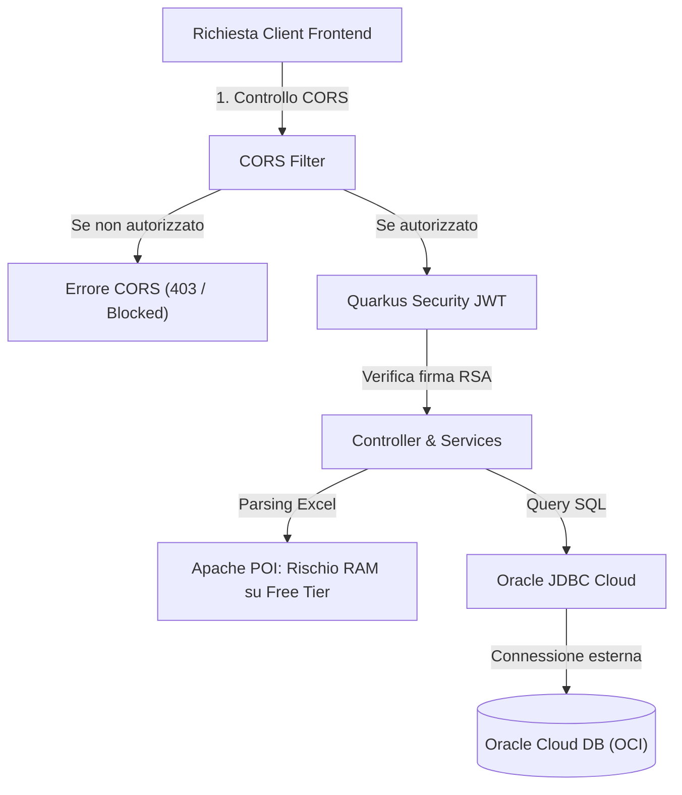

# Report di Audit e Valutazione: Deploy Backend "MoneyStats" su Render

> Data analisi: Settembre 2026  
> Progetto: `money-stats`  
> Framework: Quarkus 3.32.3 (Java 21)

---

## 1. Executive Summary

Il backend **MoneyStats** è un'applicazione REST Java 21 basata sul framework **Quarkus** con persistenza Hibernate ORM (Panache), sicurezza JWT SmallRye e driver per database **Oracle**.

> [!WARNING]
> **Stato attuale per il deploy su Render: NON ANCORA PRONTO**  
> Se si prova a collegare oggi il repository GitHub a Render per un deploy diretto, **il deploy fallirà**. Ci sono **4 elementi bloccanti** e **4 criticità architetturali** da sistemare prima di andare online.

---

## 2. Caratteristiche Presenti nel Progetto

| Ambito | Caratteristica Implementata | Note Tecniche |
| :--- | :--- | :--- |
| **Framework & Runtime** | Quarkus 3.32.3 + Java 21 | Moderno, reattivo, tempi di avvio rapidi e basso overhead di memoria rispetto a Spring Boot. |
| **API REST** | Endpoints per Auth, Movimenti, Categorie, Conti, Hashtag, Utenti | JAX-RS / Quarkus REST con RESTEasy Reactive e serializzazione Jackson. |
| **Autenticazione & Sicurezza** | JWT Stateless (SmallRye JWT) + BCrypt (Quarkus Elytron) | Registrazione e login con rilascio token JWT (scadenza 6 ore), cifratura password con BCrypt. |
| **Business Logic & Analytics** | Statistiche aggregate per intervallo (giorno, settimana, mese, anno) e dashboard | Logica completa in `StatisticServiceBean` e `MovimentoBean`. |
| **Importazione Dati** | Import file Excel (.xlsx) | Gestione upload multipart con Apache POI (`ExcelReaderBean`). |
| **Data Layer** | Hibernate ORM con Panache Pattern | Repository pattern (`PanacheRepositoryBase`) e mappatura JPA entità relazionali. |
| **Mapping DTO** | MapStruct | Mappatura automatica tra Entity JPA e DTO di trasporto. |
| **Logging** | Access Log configurato | Access log HTTP con tracciamento IP, metodo, endpoint, status code e tempi di risposta. |
| **CI/CD** | GitHub Actions (`.github/workflows/ci.yml`) | Step di checkout, setup JDK 21 e `mvnw verify`. |

---

## 3. Elementi Bloccanti per Render (Showstoppers)

### 🔴 Bloccante 1: Mancanza di un Dockerfile per Cloud Build (Multi-Stage)
* **Problema**: Render non supporta nativamente Java/Maven per i Web Service standard (supporta Node, Python, Go, Rust, Ruby). Richiede l'ambiente **Docker**.
* **Dettaglio**: In `src/main/docker/Dockerfile.jvm` esiste un Dockerfile Quarkus, ma presuppone che il comando `mvnw package` sia già stato eseguito sull'host prima del build (`COPY target/quarkus-app/...`). Poiché `target/` è in `.gitignore`, il build su Render fallirà immediatamente.
* **Soluzione**: Creare un `Dockerfile` alla radice con approccio **Multi-Stage** (Stage 1: build con Maven + JDK 21; Stage 2: immagine runtime leggera OpenJDK 21).

### 🔴 Bloccante 2: Gestione Porta Dinamica (`PORT`)
* **Problema**: Render assegna all'applicazione una porta tramite la variabile d'ambiente `PORT` (di norma `10000`) o ascolta su quella esposta.
* **Dettaglio**: In `application.properties`, non è definita la porta e Quarkus ascolta su `8080`. Se la porta non è allineata con Render, i controlli di routing andranno in timeout (`Port scan timeout`).
* **Soluzione**: Impostare in `application.properties`:
  ```properties
  quarkus.http.port=${PORT:8080}
  ```

### 🔴 Bloccante 3: Profilo di Produzione Mancante (`%prod`)
* **Problema**: Nel file `application.properties`, il datasource Oracle è configurato **solo** sotto `%dev` e `%cloud`:
  ```properties
  %dev.quarkus.datasource.jdbc.url=...
  %cloud.quarkus.datasource.jdbc.url=...
  ```
* **Dettaglio**: Quando Quarkus viene impacchettato e avviato con `java -jar quarkus-run.jar`, il profilo di default è **`prod`**. Senza aver definito le proprietà per `%prod` o senza passare `-Dquarkus.profile=cloud`, Quarkus fallirà il bootstrap per assenza di configurazione datasource.
* **Soluzione**: Configurare in `application.properties` le proprietà per il profilo `%prod` (o generali) leggendo variabili d'ambiente standard.

### 🔴 Bloccante 4: Raggiungibilità del Database Oracle e Oracle Wallet
* **Problema**: Render non fornisce un servizio Oracle Database (supporta solo PostgreSQL e Redis). Il database deve risiedere su un servizio esterno (es. Oracle Cloud Infrastructure - OCI Autonomous DB).
* **Dettaglio**:
  - Se si utilizza il database sul PC locale (`homepc:1521`), Render **non può raggiungerlo** (rete privata/NAT).
  - Se si usa **Oracle Autonomous Database**, nel file `.env` locale è presente un riferimento a un Wallet con path Windows:
    `cloud-oracle-moneystats-url=jdbc:oracle:thin:@mnydb_medium?TNS_ADMIN=C:/DB/Wallet_MNYDB`
    Questo percorso su Linux non esiste.
* **Soluzione**:
  - Usare connessione **TLS senza Wallet** (porta 1522 TLS 1.2 plain su OCI).
  - Oppure caricare i file del Wallet come **Secret Files** su Render (es. `/etc/secrets/wallet`) e impostare `TNS_ADMIN=/etc/secrets/wallet`.

---

## 4. Criticità e Caratteristiche Mancanti



### 🟡 Criticità 1: CORS Policy bloccata su `localhost:4200`
In `application.properties`:
```properties
quarkus.http.cors.origins=http://localhost:4200
```
In produzione, il frontend sarà su un dominio pubblico (es. Netlify, Vercel o Render). Tutte le chiamate API dal browser verranno bloccate.
* **Soluzione**: Rendere l'origine configurabile via env var: `quarkus.http.cors.origins=${CORS_ORIGINS:http://localhost:4200}`.

### 🟡 Criticità 2: Limite di Memoria Free Tier di Render (512 MB RAM)
Il piano gratuito di Render fornisce 512 MB di RAM. Java 21 + Quarkus + Hibernate + Apache POI (parsing fogli Excel con allocazione oggetti) possono superare tale soglia, causando il riavvio immediato dell'istanza con `Exit Code 137 (OOMKilled)`.
* **Soluzione**: Impostare nel Dockerfile o nella variabile `JAVA_OPTS_APPEND`:
  ```bash
  -Xms128m -Xmx320m -XX:+UseSerialGC -XX:MaxRAMPercentage=65
  ```

### 🟡 Criticità 3: Health Check per Zero-Downtime e Monitoring
Render offre controlli di integrità tramite un path configurabile (Health Check Path). In `application.properties` c'è l'esclusione dai log per `/q/health/.*`, ma nel `pom.xml` **manca** l'estensione `quarkus-smallrye-health`.
* **Soluzione**: Aggiungere la dipendenza Maven `io.quarkus:quarkus-smallrye-health` per esporre `/q/health/live` e `/q/health/ready`.

### 🟡 Criticità 4: Variabili JWT mancanti
Senza configurare `JWT_PUBLIC_KEY` e `JWT_PRIVATE_KEY` nelle variabili d'ambiente di Render, l'applicazione non riuscirà a firmare o verificare i token JWT.

### 🟡 Criticità 5: Assenza di Migrazioni Automatiche del Database
Il progetto contiene gli script DDL in `sql/` (`creazione_tabelle.sql`, `sequence.sql`, `creazione_viste.sql`), ma non usa Flyway o Liquibase. Le tabelle e le sequenze devono essere create preventivamente nel database prima di avviare il backend.

### 🟡 Criticità 6: Assenza di Test Unitari (`src/test`)
Non ci sono classi di test automatizzate, quindi il workflow CI si limita a verificare la compilazione senza validare la logica applicativa.

---

## 5. Matrice di Confronto: Stato Attuale vs Requisiti Render

| Aspetto | Stato Attuale | Requisito Render | Pronto? |
| :--- | :--- | :--- | :---: |
| **Runtime Container** | Solo file template in `src/main/docker` che cercano `target/` | Multi-Stage `Dockerfile` in root con build Maven | ❌ NO |
| **Porta Web** | 8080 fisso | Dinamica su `${PORT:8080}` | ❌ NO |
| **Profilo Produzione** | Configurato solo `%dev` e `%cloud` | Mappatura profilo `%prod` o variabili standard | ❌ NO |
| **Database Esterno** | URL verso PC locale o wallet locale `C:/DB/...` | Oracle Cloud con TLS o Wallet montato su Linux path | ❌ NO |
| **CORS Origins** | `http://localhost:4200` | Variabile d'ambiente `CORS_ORIGINS` | ❌ NO |
| **JWT Environment** | Letto da `.env` locale | Variabili d'ambiente nel pannello Render | ⚠️ Da configurare |
| **Tuning Memoria** | Nessun vincolo JVM restrittivo | Parametri JVM per stare sotto i 512MB | ⚠️ Da configurare |
| **Health Check** | Regola nei log presente, ma dipendenza mancante | Estensione `quarkus-smallrye-health` | ⚠️ Opzionale raccomandato |
| **IaC / Blueprint** | Assente | File `render.yaml` per setup automatico | ⚠️ Opzionale raccomandato |

---

## 6. Configurazione Pronta per Render

### A. Esempio `Dockerfile` Multi-Stage (da posizionare nella root)
```dockerfile
# Stage 1: Build dell'applicazione con Maven e JDK 21
FROM maven:3.9.9-eclipse-temurin-21 AS builder
WORKDIR /app
COPY pom.xml mvnw mvnw.cmd ./
COPY .mvn ./.mvn
# Pre-download delle dipendenze per velocizzare i build successivi
RUN ./mvnw dependency:go-offline -B
COPY src ./src
RUN ./mvnw package -DskipTests -B

# Stage 2: Immagine Runtime minimale UBI9 OpenJDK 21
FROM registry.access.redhat.com/ubi9/openjdk-21-runtime:1.24
ENV LANGUAGE='it_IT:it'
USER 185
WORKDIR /deployments

COPY --from=builder --chown=185 /app/target/quarkus-app/lib/ /deployments/lib/
COPY --from=builder --chown=185 /app/target/quarkus-app/*.jar /deployments/
COPY --from=builder --chown=185 /app/target/quarkus-app/app/ /deployments/app/
COPY --from=builder --chown=185 /app/target/quarkus-app/quarkus/ /deployments/quarkus/

EXPOSE 8080
ENV JAVA_OPTS_APPEND="-Dquarkus.http.host=0.0.0.0 -Djava.util.logging.manager=org.jboss.logmanager.LogManager -Xms128m -Xmx320m -XX:+UseSerialGC"
ENV JAVA_APP_JAR="/deployments/quarkus-run.jar"

ENTRYPOINT [ "/opt/jboss/container/java/run/run-java.sh" ]
```

### B. Proprietà da aggiornare in `src/main/resources/application.properties`
```properties
# PORTA DINAMICA RENDER
quarkus.http.port=${PORT:8080}

# CORS DINAMICO PER FRONTEND
quarkus.http.cors.origins=${CORS_ORIGINS:http://localhost:4200}

# DATASOURCE PER IL PROFILO PROD
%prod.quarkus.datasource.db-kind=oracle
%prod.quarkus.datasource.username=${ORACLE_DB_USER}
%prod.quarkus.datasource.jdbc.url=${ORACLE_DB_URL}
%prod.quarkus.datasource.password=${ORACLE_DB_PASSWORD}
```

### C. Variabili d'ambiente da configurare nella Dashboard di Render
* `QUARKUS_PROFILE`: `prod`
* `PORT`: `8080` (oppure `10000`, gestita in automatico con `${PORT:8080}`)
* `ORACLE_DB_USER`: l'utente del database Oracle Cloud
* `ORACLE_DB_PASSWORD`: la password del database
* `ORACLE_DB_URL`: la stringa di connessione JDBC (es. `jdbc:oracle:thin:@...`)
* `JWT_PUBLIC_KEY`: la chiave pubblica RSA
* `JWT_PRIVATE_KEY`: la chiave privata RSA
* `CORS_ORIGINS`: l'URL del frontend (es. `https://mio-frontend.vercel.app`)
